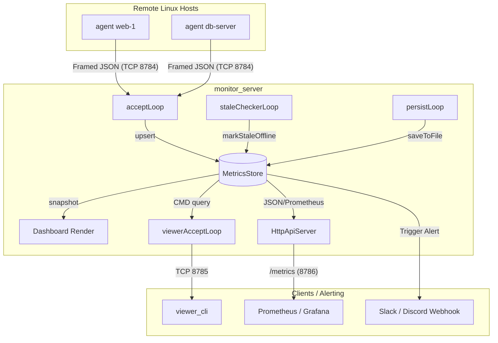

# 🖥️ Distributed System Monitor

[](https://en.cppreference.com/w/cpp/compiler_support/20)
[](https://www.linux.org)
[](https://invisible-island.net/ncurses/)
[](#build)
[-brightgreen.svg?style=flat-square)](#testing-suite)

A **btop++-style** distributed host monitoring tool written in **C++20**. It displays real-time metrics from multiple remote agents in a high-fidelity terminal dashboard, requiring **zero external dependencies** beyond `ncurses`.

---

## ✨ Key Features

*   **🎮 Rich Terminal UI**: Responsive, btop++-inspired interface with 6 curated color themes, Braille character sparkline charts, and custom UTF-8 progress bars.
*   **📡 Sharded & Multi-threaded**: High-performance, concurrent TCP server with framing to ingest metrics from hundreds of nodes.
*   **🚨 Alert Webhooks**: Immediate notifications (to Slack, Discord, Microsoft Teams, etc.) on `ALERT`, `STALE`, and `OFFLINE` status transitions and recoveries.
*   **📊 HTTP API & Prometheus**: Built-in HTTP/1.1 endpoints to query hosts, stats, logs, and a native `/metrics` endpoint for Prometheus scraping.
*   **🔍 Interactive Viewer CLI**: Remote administrative CLI to query system state, metric histories, and event logs on demand.
*   **🧪 Rock-Solid QA**: Robust testing harness featuring **34 unit tests** and **32 end-to-end integration tests** executing fast-interval status transition simulations.

---

## 🚀 Quick Start

```bash
# 1. Build all binaries
./build.sh

# 2. Start the server (runs the dashboard in your terminal)
./monitor_server

# 3. Connect agents from target machines to monitor
./agent -server 127.0.0.1:8784 -name web-server-1

# 4. (Optional) Access the interactive query CLI from another shell
./viewer_cli -server 127.0.0.1:8785
```

> [!TIP]
> **Run the Interactive Demo**: Spin up a simulated environment with multiple agents, custom thresholds, and a remote viewer in three tmux/gnome-terminals:
> ```bash
> ./run_demo_terminals.sh --agents 3 --stale 5 --offline 10
> ```

---

## 🎨 Themes & Customization

The dashboard adapts to 256-color terminals. Press **`U`** or **`Ctrl+U`** in the dashboard to cycle between themes:

| Theme ID | Name | Styling Aesthetic |
|:---:|---|---|
| **1** | `BLOODLINE` | Crimson borders, neon electric cyan accents, stark hacker theme |
| **2** | `MOCHA` | Catppuccin Mocha pastels with lavender highlights |
| **3** | `NORD` | Cool arctic blues and clean aurora green indicator colors |
| **4** | `DRACULA` | Vibrant gothic purples, high-contrast pink and neon cyan |
| **5** | `MATRIX` | Cybernetic monochrome lime green terminal cascade |
| **6** | `CYBERPUNK` | Hyper-saturated neon magenta, acid yellow, and toxic cyan |

---

## 📐 Terminal Requirements

*   **Minimum Dimensions**: `60 × 15` cells. If size is insufficient, the UI displays a warning showing coordinates needed.
*   **Recommended Dimensions**: `120 × 35+` cells for the full layout (simultaneous viewing of host panels, charts, network streams, and logs).

---

## 🗺️ System Architecture



---

## 📂 Project Directory Structure

```
monitor/
├── monitor_server          # Server binary (ingestor & dashboard)
├── agent                   # Metric collection agent (Linux-only daemon)
├── viewer_cli              # Remote query shell client
├── build.sh                # Optimized native compilation script
├── CMakeLists.txt          # Cross-platform build script
│
├── config/
│   ├── server.conf         # Server configuration (IP limits, ports, timers)
│   ├── agent.conf          # Agent configuration (connect retries, timeouts)
│   └── thresholds.conf     # Alert threshold rules (global & per-host)
│
├── include/
│   ├── protocol.hpp        # Shared network framing constants and statuses
│   ├── metrics_store.hpp   # Thread-safe sharded database & backup
│   ├── metrics_collector.hpp # Linux /proc file system parser
│   ├── dashboard.hpp       # ncurses layout and rendering routines
│   ├── net_framing.hpp     # Frame packet framing protocol
│   ├── json_wrapper.hpp    # Standard nlohmann/json parser wrapper
│   ├── json_helper.hpp     # Hand-optimized fallback JSON parser
│   ├── thresholds.hpp      # Threshold parser & evaluator
│   ├── server_stats.hpp    # Performance and server metrics
│   └── alerting.hpp        # Alert dispatch (cURL HTTP post)
│
└── src/
    ├── server/             # monitor_server sources
    ├── agent/              # agent sources
    └── viewer/             # viewer_cli sources
```

---

## 🛠️ Build & Installation

### 1. Install Dependencies

```bash
# Debian / Ubuntu
sudo apt install g++ cmake libncursesw5-dev

# Fedora / RHEL
sudo dnf install gcc-c++ cmake ncurses-devel

# Arch Linux
sudo pacman -S gcc cmake ncurses
```

### 2. Compilation Options

**Method A: Simplified build script (default)**
```bash
./build.sh
```

**Method B: CMake (Recommended for development)**
```bash
mkdir build && cd build
cmake -DCMAKE_BUILD_TYPE=Release ..
make -j$(nproc)
```

---

## ⚙️ Configuration Guides

### 1. Server Configuration (`config/server.conf`)

Configure runtime variables, backup schedules, and logging:

```ini
MAX_AGENTS_PER_IP=3       # Prevent spoofing/flooding (max agents per IP)
BACKUP_INTERVAL_SEC=10    # Writes in-memory database to disk every 10s
STATE_FILE=data/monitor_state.db # DB location (restored as STALE on boot)

STALE_SEC=30              # No report for 30s transitions status to STALE
OFFLINE_SEC=90            # No report for 90s transitions status to OFFLINE

# ALERT_WEBHOOK_URL=http://localhost:9999/alert # Destination webhook URL
ALERT_COOLDOWN_SEC=300    # Prevent alert spamming (5m cooldown)
HTTP_API_PORT=8786        # HTTP API listener port
```

### 2. Thresholds Configuration (`config/thresholds.conf`)

Set global thresholds or define per-host overrides. If a metrics value exceeds the threshold, the host enters `ALERT` (or `WARNING` if it reaches $\ge 85\%$ of the limit).

```ini
# Global limits (%)
CPU=80
RAM=90
DISK=85

# Per-host overrides (case-insensitive)
web-server-1.cpu=75
db-master.ram=95
```

---

## 📊 Integrations & Remote Access

### 1. HTTP API Endpoints

The server hosts a high-performance HTTP server at `HTTP_API_PORT` (default `8786`):

*   `GET /api/hosts` — List all hosts, IPs, resource usages, and statuses in JSON.
*   `GET /api/stats` — Server statistics (uptime, alerts sent, message rates).
*   `GET /api/log` — Recent monitoring event logs.
*   `GET /api/history/<host>` — JSON history samples for a given host name.
*   `GET /metrics` — Prometheus gauge exports.
*   `GET /healthz` — Server health state.

### 2. Prometheus Configuration

Add the server as a target in your `prometheus.yml`:

```yaml
scrape_configs:
  - job_name: 'distributed-monitor'
    static_configs:
      - targets: ['localhost:8786']
```

---

## 🧪 Testing Suite

The repository contains a rigorous testing harness to ensure logic and protocol stability.

### 1. C++ Unit Tests (`test/unit_test.cpp`)

To compile and run the 34 native unit tests testing framing, parser escapes, configs, UI buffers, and concurrent store accesses:
```bash
g++ -std=c++20 -O2 -Wall -Iinclude test/unit_test.cpp -o test/unit_test -lncursesw
./test/unit_test
```

### 2. E2E Integration Tests (`test/integration_test_full.sh`)

Executes 32 end-to-end scenarios, checking agent handshakes, auth rejections, transition states, database save/load cycles, and fast-interval stress scenarios:
```bash
# Runs full E2E scripts on mock ports (9981-9983)
./test/integration_test_full.sh
```

---

## 🔒 Security Best Practices

> [!WARNING]
> Metric payloads contain detailed process counts, system names, IPs, and disk structures. Protect this telemetry data.

1.  **Configure Tokens**: Set a strong `AUTH_TOKEN` in `config/server.conf` and `config/agent.conf` to block unauthorized connections.
2.  **Private Networks**: Run metric communication over secure overlays (e.g. Tailscale, WireGuard) or SSH port tunnels. The protocol is raw TCP and does not support native TLS wrapper encapsulation.
3.  **Firewalling**: Use `iptables` or `ufw` to restrict incoming TCP traffic on ports `8784`, `8785`, and `8786` to trusted subnets.
